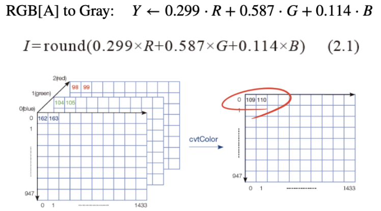

# 01. 이미지 불러오기 및 그레이스케일 변환

OpenCV를 사용하여 이미지를 불러오고, 원본 이미지와 그레이스케일로 변환된 이미지를 나란히 표시하는 실습입니다.

## 📂 파일 정보
*   **파일명**: `1.py`
*   **사용된 주요 함수**: `cv.imread()`, `cv.cvtColor()`, `np.hstack()`, `cv.imshow()`, `cv.imwrite()`, `cv.waitKey()`, `cv.destroyAllWindows()`

**[참고: 그레이스케일 변환 원리]**
그레이스케일 변환은 RGB 색상 채널의 값을 특정 공식(Y = 0.299R + 0.587G + 0.114B)에 따라 가중 평균을 내어 하나의 밝기 값으로 만드는 과정입니다.



## 코드 

```python
import cv2 as cv  # OpenCV 라이브러리를 cv라는 이름으로 임포트합니다.
import numpy as np  # 배열 및 수치 계산을 위한 numpy 라이브러리를 임포트합니다.
import sys  # 프로그램 강제 종료(exit) 기능을 쓰기 위해 sys 모듈을 가져옵니다.

# cv.imread()를 사용하여 이미지 파일(soccer.jpg)을 로드합니다. (절대 경로 사용)
img = cv.imread(r'c:\opencv_\computer-vision\opencv\images\soccer.jpg')

# 이미지 사이즈 축소: 원본의 가로, 세로를 각각 0.5배(50%)로 줄입니다.
img = cv.resize(img, dsize=(0, 0), fx=0.5, fy=0.5)

if img is None:  # 만약 이미지를 불러오지 못했다면(None) 실행합니다.
    print("이미지를 불러올 수 없습니다. 경로를 확인해주세요.")  # 에러 메시지를 출력합니다.

else:  # 이미지를 정상적으로 불러왔을 경우 실행합니다.
    # cv.cvtColor() 함수를 사용해 색상 이미지(BGR)를 흑백(Grayscale)으로 변환합니다.
    gray = cv.cvtColor(img, cv.COLOR_BGR2GRAY)

    # np.hstack() 연결을 위해 흑백(1채널) 이미지를 출력용 3채널(BGR)로 다시 변환합니다.
    # (원본의 채널 수와 맞춰야 가로로 합칠 수 있습니다.)
    gray_bgr = cv.cvtColor(gray, cv.COLOR_GRAY2BGR)

    # np.hstack() 함수를 이용해 원본이미지(img)와 흑백이미지(gray_bgr)를 가로로 나란히 연결합니다.
    result = np.hstack((img, gray_bgr))

    # cv.imshow() 함수로 'Original and Grayscale'이라는 창에 결과 이미지를 화면에 표시합니다.
    cv.imshow('Original and Grayscale', result)

    # 작업 완료된 결과 이미지를 '1_result.jpg'라는 이름의 파일로 저장합니다.
    cv.imwrite(r'c:\opencv_\computer-vision\opencv\01주차 과제\1_result.jpg', result)

    # 사용자가 키보드에서 아무 키나 누를 때까지 창을 띄운 채로 무한히 기다립니다.
    cv.waitKey(0)
    
    # 사용자가 키를 눌러 대기 상태가 끝나면, 열려 있던 모든 이미지 창을 닫습니다.
    cv.destroyAllWindows()

```


## 문제 해결 방법

1. cv.imread()를 사용해서 이미지를 로드합니다.
    -> img = cv.imread(r'c:\opencv_\computer-vision\opencv\images\soccer.jpg') 에 저장되어있으므로 여기서 사진을 불러옵니다. 

 


2. cv.resize()를 사용해서 이미지 사이즈를 축소합니다.
    -> img = cv.resize(img, dsize=(0, 0), fx=0.5, fy=0.5)  여기서 이미지 사이즈를 1/2로 축소합니다.  

3. cv.cvtColor()를 사용해서 이미지를 그레이스케일로 변환합니다.
    -> gray = cv.cvtColor(img, cv.COLOR_BGR2GRAY) 이미지를 그레이스케일로 변환합니다. 


4. np.hstack()을 사용해서 이미지를 가로로 합칩니다.
    -> hybrid = np.hstack((img, gray)) 이미지를 가로로 합칩니다. 


5. cv.imshow()를 사용해서 이미지를 화면에 표시합니다.
    -> cv.imshow('Original vs Grayscale', hybrid) 이 코드로 이미지를 화면에 표시합니다. 

6. cv.waitKey()를 사용해서 키보드 입력을 기다립니다.
    -> cv.waitKey(0) 이 코드로 키보드 입력을 기다립니다. 

7. cv.destroyAllWindows()를 사용해서 이미지를 화면에서 닫습니다.
    -> cv.destroyAllWindows() 이 코드를 사용하여 이미지를 화면에서 닫습니다. 


## 🖼 결과물 (`1_result.jpg`)

