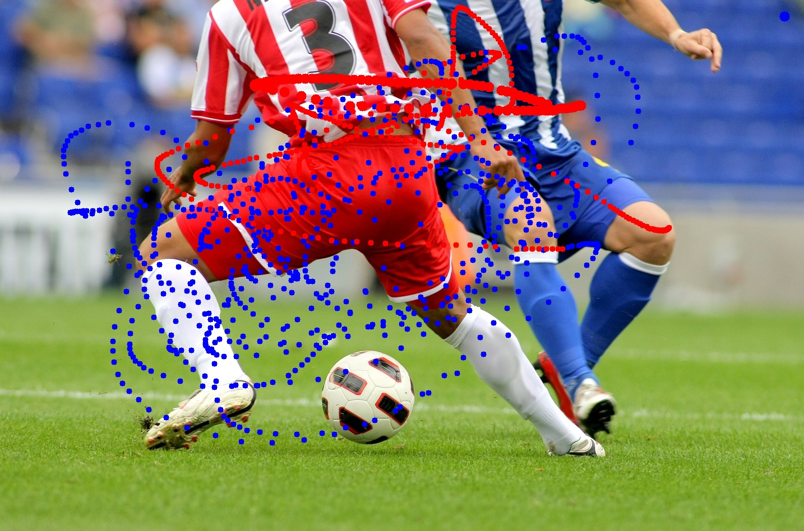

# 02. 페인팅 붓 크기 조절 기능

마우스 입력을 통해 이미지 위에 그림을 그리고, 키보드 입력을 통해 붓의 크기를 조절하는 인터랙티브 실습입니다.

## 📂 파일 정보
*   **파일명**: `2.py`
*   **사용된 주요 함수**: `cv.setMouseCallback()`, `cv.circle()`, `cv.waitKey()`

## 🖼 결과물 (`2_result.jpg`)

## ⌨️ 조작 방법
*   **좌클릭**: 파란색 그리기
*   **우클릭**: 빨간색 그리기
*   **드래그**: 연속 그리기
*   **+ / -**: 붓 크기 조절 (1 ~ 15)
*   **q**: 종료 및 결과 저장
