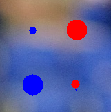
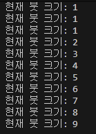
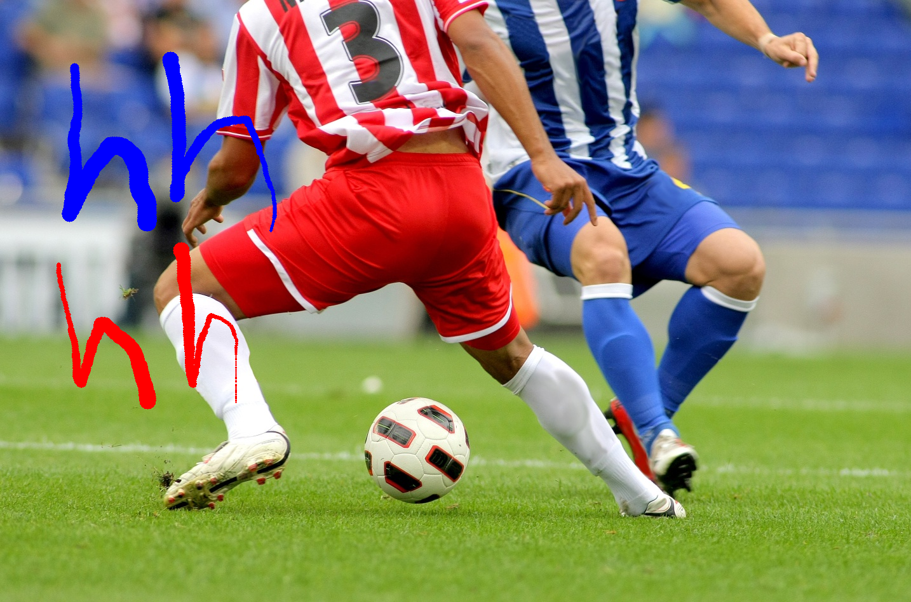

# 02. 페인팅 붓 크기 조절 기능

마우스 입력을 통해 이미지 위에 그림을 그리고, 키보드 입력을 통해 붓의 크기를 조절하는 인터랙티브 실습입니다.

## 📂 파일 정보
*   **파일명**: `2.py`
*   **사용된 주요 함수**: `cv.imread()`, `cv.namedWindow()`, `cv.setMouseCallback()`, `cv.circle()`, `cv.imshow()`, `cv.waitKey()`, `cv.imwrite()`

## 코드

```python
import cv2 as cv  # OpenCV 라이브러리를 cv라는 이름으로 임포트합니다.
import numpy as np  # 배열 및 수치 계산을 위한 numpy 라이브러리를 임포트합니다.
import sys  # 프로그램 강제 종료(exit) 기능을 쓰기 위해 sys 모듈을 가져옵니다.

brush_size = 5  # 붓의 초기 크기를 5로 설정합니다.
drawing = False  # 마우스가 눌려진 상태인지(그리는 중인지) 확인할 변수입니다.
color = (255, 0, 0)  # 초기 붓 색상을 파란색(BGR: 255, 0, 0)으로 설정합니다.

# 배경으로 사용할 축구공 이미지를 읽어옵니다. 
img = cv.imread(r'c:\opencv_\computer-vision\opencv\images\soccer.jpg')

if img is None:  # 이미지를 정상적으로 불러오지 못했다면 실행합니다.
    print("이미지를 불러올 수 없습니다. 경로를 확인해주세요.")  # 에러 메시지를 출력합니다.
    exit()  # 프로그램을 종료합니다.

def draw_circle(event, x, y, flags, param):  # 마우스 이벤트를 처리할 함수를 정의합니다.
    global drawing, color, brush_size  # 전역 변수들을 함수 내에서 사용하도록 선언합니다.

    if event == cv.EVENT_LBUTTONDOWN:  # 마우스 왼쪽 버튼을 눌렀을 때 실행합니다.
        drawing = True  # 그리기 상태를 활성화(True)합니다.
        color = (255, 0, 0)  # 색상을 파란색으로 변경합니다.
        cv.circle(img, (x, y), brush_size, color, -1)  # 클릭한 위치에 원을 그립니다. (-1은 채우기)

    elif event == cv.EVENT_RBUTTONDOWN:  # 마우스 오른쪽 버튼을 눌렀을 때 실행합니다.
        drawing = True  # 그리기 상태를 활성화(True)합니다.
        color = (0, 0, 255)  # 색상을 빨간색으로 변경합니다.
        cv.circle(img, (x, y), brush_size, color, -1)  # 클릭한 위치에 원을 그립니다.

    elif event == cv.EVENT_MOUSEMOVE:  # 마우스를 움직일 때 실행합니다.
        if drawing:  # 버튼이 눌려진 상태(그리는 중)라면 실행합니다.
            cv.circle(img, (x, y), brush_size, color, -1)  # 마우스 경로를 따라 계속 원을 그립니다.

    elif event == cv.EVENT_LBUTTONUP or event == cv.EVENT_RBUTTONUP:  # 마우스 버튼을 떼면 실행합니다.
        drawing = False  # 그리기를 중단(False)합니다.

cv.namedWindow('Drawing App')  # 'Drawing App'이라는 이름의 윈도우 창을 생성합니다.
cv.setMouseCallback('Drawing App', draw_circle)  # 생성한 창에 마우스 이벤트 함수(draw_circle)를 연결합니다.

print("--- 사용 방법 ---")  # 사용 안내 문구를 출력합니다.
print("좌클릭: 파란색 / 우클릭: 빨간색")  # 색상 조작법을 안내합니다.
print("+ : 붓 크기 증가 (최대 15)")  # 크기 증가 키를 안내합니다.
print("- : 붓 크기 감소 (최소 1)")  # 크기 감소 키를 안내합니다.
print("q : 종료 및 저장")  # 종료 및 저장 키를 안내합니다.

while True:  # 사용자가 종료할 때까지 무한 반복합니다.
    cv.imshow('Drawing App', img)  # 화면에 현재 이미지 상태를 실시간으로 보여줍니다.
    
    key = cv.waitKey(1) & 0xFF  # 1밀리초 동안 키 입력을 기다리고 입력된 키 값을 가져옵니다.

    if key == ord('q'):  # 'q' 키를 누르면 실행합니다.
        break  # 반복문을 빠져나가 종료 단계로 이동합니다.
    
    elif key == ord('+') or key == ord('='):  # '+' 키(또는 = 키)를 누르면 실행합니다.
        brush_size = min(15, brush_size + 1)  # 붓 크기를 1 늘리되, 최대 15를 넘지 않게 합니다.
        print(f"현재 붓 크기: {brush_size}")  # 현재 붓 크기를 터미널에 표시합니다.
        
    elif key == ord('-'):  # '-' 키를 누르면 실행합니다.
        brush_size = max(1, brush_size - 1)  # 붓 크기를 1 줄이되, 최소 1보다 작아지지 않게 합니다.
        print(f"현재 붓 크기: {brush_size}")  # 현재 붓 크기를 터미널에 표시합니다.

# 작업이 끝난 이미지를 '2_result.jpg' 파일로 저장합니다.
cv.imwrite(r'c:\opencv_\computer-vision\opencv\images\2_result.jpg', img)

cv.destroyAllWindows()  # 열려 있는 모든 윈도우 창을 닫고 프로그램을 종료합니다.

```

## 문제 해결 방법

1. **이미지 로드 및 윈도우 생성**
   * `cv.imread()`를 통해 배경 이미지를 불러오고, `cv.namedWindow()`로 그림을 그릴 창을 만듭니다.
    
2. **마우스 콜백 함수 정의 (`draw_circle`)**
   * 마우스 이벤트(`EVENT_LBUTTONDOWN`, `EVENT_MOUSEMOVE` 등)에 따라 원을 그리는 로직을 작성합니다.
   * `cv.circle()`의 마지막 인자를 `-1`로 설정하여 내부가 채워진 원을 그립니다.

   


3. **키보드 입력 처리 루프**
   * `cv.waitKey(1)`를 사용하여 실시간으로 키 입력을 확인합니다.
   * `+`와 `-` 키 입력 시 `brush_size` 변수를 조절하며, `min/max` 함수로 범위를 1~15로 제한합니다.
   
   

4. **결과 확인 및 저장**
   * `q` 키가 입력되면 루프를 탈출하고 `cv.imwrite()`를 호출하여 최종 이미지를 저장합니다.

## 🖼 결과물 (`2_result.png`)


