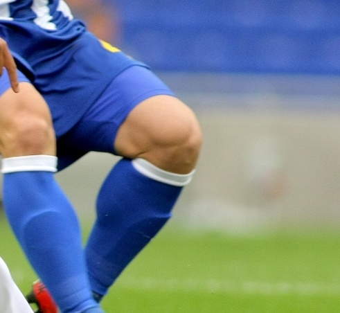

# 03. 마우스 ROI(관심영역) 추출

사용자가 마우스 드래그로 이미지의 특정 영역을 선택하고, 해당 영역만 따로 잘라내어 저장하는 실습입니다.

## 📂 파일 정보
*   **파일명**: `3.py`
*   **사용된 주요 함수**: `cv.rectangle()`, `Numpy Slicing`, `cv.imwrite()`

## 🖼 결과물 (`3_result.jpg`)

## ⌨️ 조작 방법
*   **드래그**: 영역 선택 (초록색 가이드)
*   **r**: 선택 영역 초기화
*   **s**: 선택 영역 저장 (`3_result.jpg`)
*   **q**: 종료
